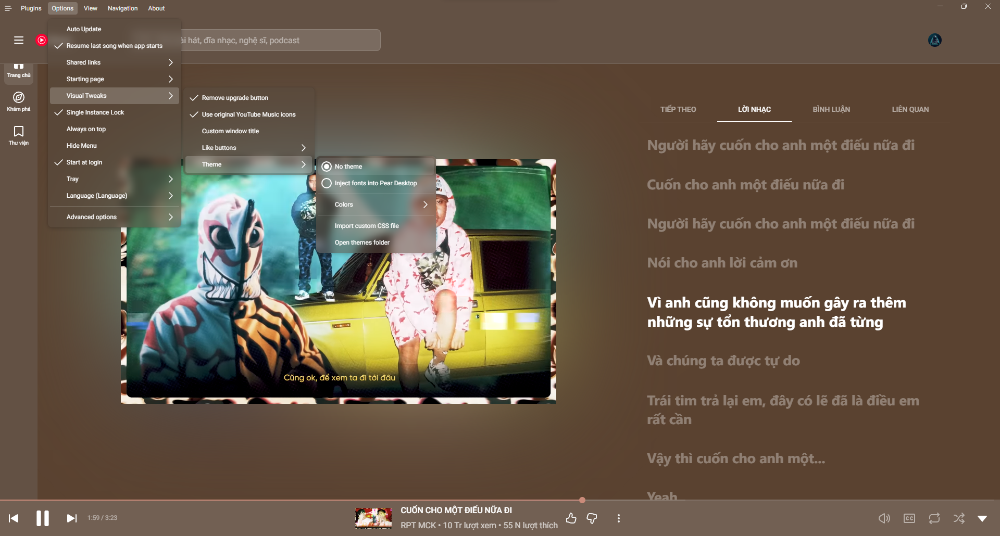
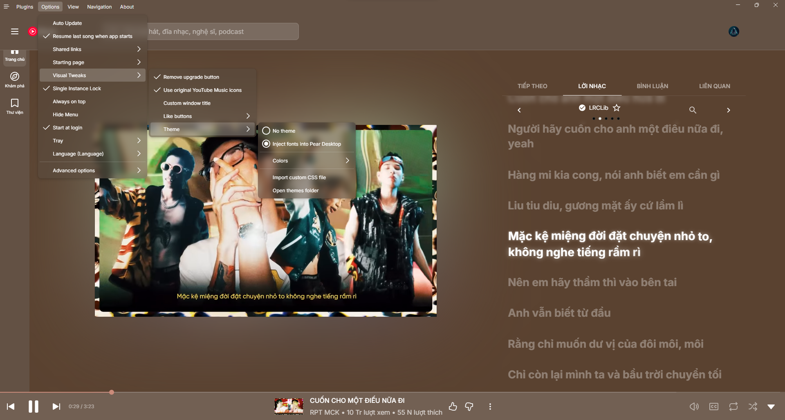

# Inter to Pear Desktop

A theme for [Pear Desktop by michei69](https://github.com/michei69/pear-desktop) that forces **Inter** as the primary font across YouTube Music while preserving the native font behavior of the navigation system.

---

<div align="center">

_Before applying_



_After applying_



</div>

---

## Features

- Loads **Inter** from Google Fonts.
- Overrides Pear Desktop's internal font variables.
- Applies Inter to common text elements throughout the interface.
- Uses `!important` to override YTM's default font rules.
- Keeps the navigation bar and guide navigation using their native font properties.


## Using a Different Font

By default, this stylesheet uses **Inter**. You can replace it with another font by changing the font name in two places:

1. Change the `@import` URL to load your desired font.
2. Replace every `'Inter'` in the CSS with your font's name.

#### Example: Using Roboto

Change:

```css
@import url('https://fonts.googleapis.com/css2?family=Inter:wght@300;400;500;600;700&display=swap');
```

to:

```css
@import url('https://fonts.googleapis.com/css2?family=Roboto:wght@300;400;500;600;700&display=swap');
```

Then replace:

```css
'Inter', sans-serif
```

with:

```css
'Roboto', sans-serif
```

### Using a Google Font

You can choose a font from [Google Fonts](https://fonts.google.com/?utm_source=chatgpt.com).

For example, if you choose **Poppins**, Google Fonts provides an import URL similar to:

```css
@import url('https://fonts.googleapis.com/css2?family=Poppins:wght@300;400;500;600;700&display=swap');
```

Then replace all occurrences of:

```css
'Inter'
```

with:

```css
'Poppins'
```

### Using a Locally Installed Font

If you already have the font installed on your system, you can usually omit the `@import` and reference the font directly:

```css
:root, html, body, ytmusic-app {
    --ytmusic-font-name: 'Your Font Name', sans-serif !important;
    --font-family: 'Your Font Name', sans-serif !important;
    font-family: 'Your Font Name', sans-serif !important;
}
```

Replace `Your Font Name` with the exact font-family name recognized by your system.

## License

This CSS customization is provided as-is. You are free to modify it for personal use.