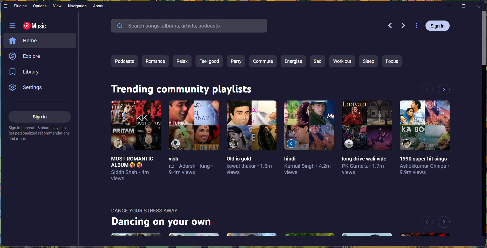
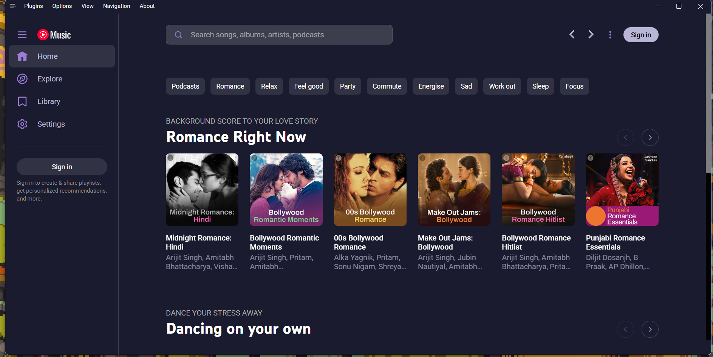

# Tokyo Night

A clean, dark theme celebrating the lights of downtown Tokyo at night.

Based on [tokyonight.nvim](https://github.com/folke/tokyonight.nvim) by folke.

---

## Variants

This theme includes three presets, selectable from **Options ▸ Visual Tweaks ▸ Theme ▸ Presets**:

| Preset | Description |
|--------|-------------|
| **Night** | Classic dark variant (default) |
| **Storm** | Darker, moodier variant |
| **Moon** | Deep purple undertones |

---

### Night (Default)

### Storm

### Moon

---

## Features

- **Album art accent sampling** - The UI accent colour dynamically adapts to the currently playing album's artwork (can be disabled by switching to a preset without the feature, or by pausing music)
- **Three presets** - Night (classic), Storm (darker), Moon (purple undertones)
- **CSS-only recolouring** - Uses the same recolouring approach as the Basic theme, mapping YouTube Music's CSS variables to the theme palette

---

## License

Based on [tokyonight.nvim](https://github.com/folke/tokyonight.nvim) (MIT licensed).